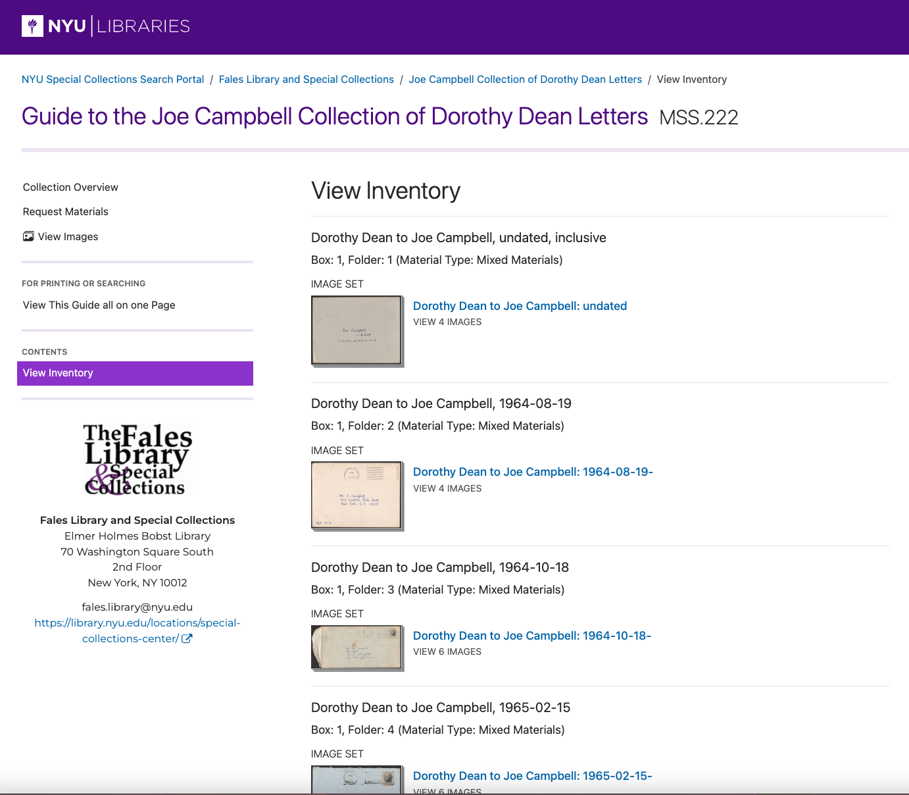
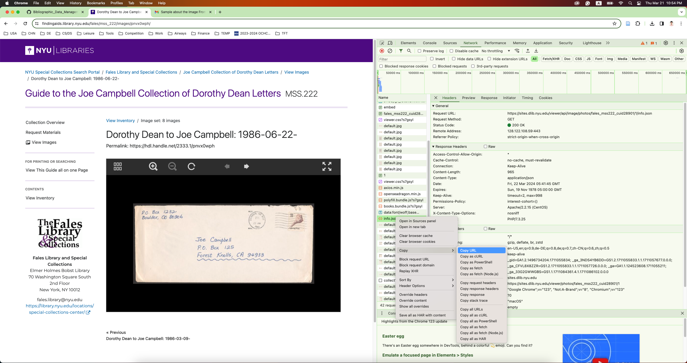

# Usage Issues

## How Do I Find the info.json

Use [this NYU library link](https://findingaids.library.nyu.edu/fales/mss_222/contents/items001/) as an example. 



1. Click the collection link and load the image viewer
2. Press F12 to open Chrome Dev Tools
3.  Switch to **network tab** in Chrome Dev tools
    + If you do load image preview in step 1, you might need to refresh the page to catch the info.json
4. Copy info.json path 
    + 

## What Will Happen If I set Parameter img_num Larger Than Actual Image Number

**Nothing** wrong will happen. The script will run smoothly and let you know when there are actually not that many images to download.

And it's recommended to set this parameters large (but not too large), especially when you are not sure how many images in the collection. (but usually NYU web page will let you know how many images in this collection.)

# Implementation Issues

## How Do You Get the Image Link

- The image is hosted by **jp2 file system**. 
- And NYU saved the jp2 link in the **info.json** while loading the image preview.
- Once we have the jp2 link, we can modify the link to get all images. 

## How Do You Know the Links for All Images In the Collection

Once we have the jp2 link, we can modify the link to get all things. 

Here is how we can modify jp2 link:

- The jp2 link looks like this:
    ```
    https://image1.dlib.nyu.edu:8183/iiif/2/photo%2Ffales_mss222_cuid28860%2Ffales_mss222_cuid28860_n000001_d.jp2/full/full/0/default.png
    ```
- The paramater means:
    + cuid28860: the index of the collection. Usually the collections in the same web page share the continous index value.
    + n000001: the index of the image
    + full (first): entire image
    + full (second): original size
    + 0: no rotation
    + default: default quality
    + png: iamge size

## Why Do You **Not** Streamlize the Part to Get info.json

We are not sure whether the other NYU library web page share the same way to load info.json. And this might not be a regular work. So for now, it's not that necessary to streamlize this part.


